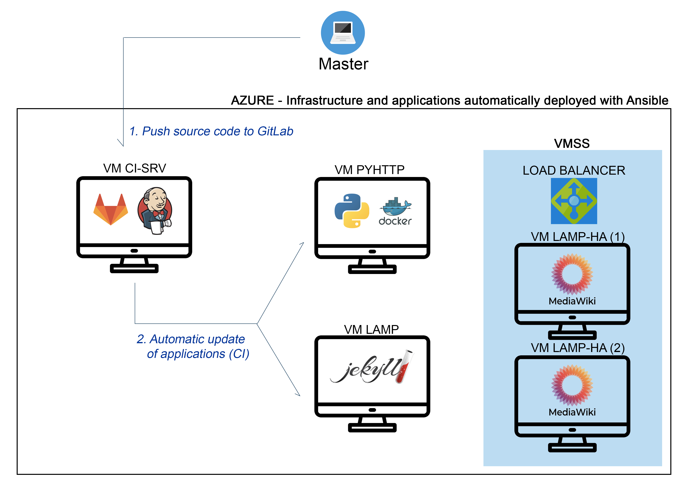

# DOCUMENTATION - Projet AJC 2021
Version: 1
Date: 19-05-2021
## I. Introduction

## II. deploy-az-it
#### II.A. Généralités
Ce playbook ansible a été développé pour permettre de déployer facilement l'ensemble de l'infrastrucure utilisée pour le projet.
#### II.B. Prérequis
Pour utiliser ce playbook, il est nécessaire d'installer au préalable sur la machine master:
- Ansible
- Azure CLI

Afin d'installer Ansible et Azure CLI, vous pouvez exécuter le script suivant dans un terminal (Debian 10):
```shell
# Ansible
sudo echo "deb http://ppa.launchpad.net/ansible/ansible/ubuntu trusty main" >> /etc/apt/sources.list
sudo apt-key adv --keyserver keyserver.ubuntu.com --recv-keys 93C4A3FD7BB9C367
sudo apt update
sudo apt install ansible

# Azure CLI
curl -sL https://aka.ms/InstallAzureCLIDeb | sudo bash
```
Dans le cadre du projet, les versions suivantes ont été utilisé:
- Ansible: 2.9.21
- Interpreteur Python: 2.7.16 (default, Oct 10 2019, 22:02:15) [GCC 8.3.0]
- Azure CLI: 2.23.0

#### II.C. Utilisation
```shell
ansible-playbook -i ../hosts infra.deploy.yml
```
## III. config-az-it
#### III.A Généralités
Les projet config-az-it est utilisé pour installer et configurer les outils de base sur l'ensemble des machines distantes.

Liste des outils installés:
- vim
- git
- htop
- zsh
- tmux
- apt-transport-https
- ca-certificates
- curl
- gnupg
- lsb-release

Liste des plugins installés:
- oh-my-zsh
- pathogen

Fichiers de configuration modifiés:
- bash (~/.bashrc)
- zsh (~/.zshrc)
- vim (~/.vimrc)
- SSH (/etc/ssh/sshd_config)

#### III.B. Prérequis
Les prérequis sont identiques à la partie **deploy-az-it** (II.B).
#### III.C Utilisation
```shell
ansible-playbook -i ../hosts infra.setup.yml
```
## XX. install-pyhttp
#### XX.A. Généralités
Le projet install-pyhttp permet de déployer rapidement un serveur HTTP écrit en Python. Afin de faciliter la mise à jour de l'application, l'ensemble du serveur est déployé dans un conteneur Docker. Pour plus de sécurité, ce serveur utilise le protocole HTTPS. 
#### XX.B. Prérequis
Pour utiliser ce playbook, il est nécessaire d'installer au préalable sur la machine master:
- Ansible
- Azure CLI

De plus, afin qu'Ansible puisse communiquer avec la machine distante, il est nécessaire d'avoir configurer au préalable une connexion SSH par clés. Cependant, si vous avez utilisé le projet _config-az-it_, cette étape a normalement déjà été réalisée.

Afin d'installer Ansible et Azure CLI, vous pouvez exécuter le script présenté dans la partie **deploy-az-it** (II.B).
#### XX.C Configuration
Avant de lancer le playbook, il est impératif d'éditer le fichier _hosts_ présent à la racine du projet. Pour cela, veuillez indiquer l'adresse IP publique de votre machine distante dans la partie [azure-pyhttp].
Il est également recommandé de modifier le fichier _vars/vars.yml_ afin de personnaliser les paramètres du playbook.
#### XX.D. Utilisation
```shell
ansible-playbook -i ../hosts pyhttp.deploy.yml
```
## À noter
Les projets _deploy-az-vmss_, _install-gitlab_, _install-jenkins_, _install-mediawiki_ et _jekyll_ sont actuellement **obsolètes** ou en phase de test et remplacés par un des projets décrit ci-dessus.
