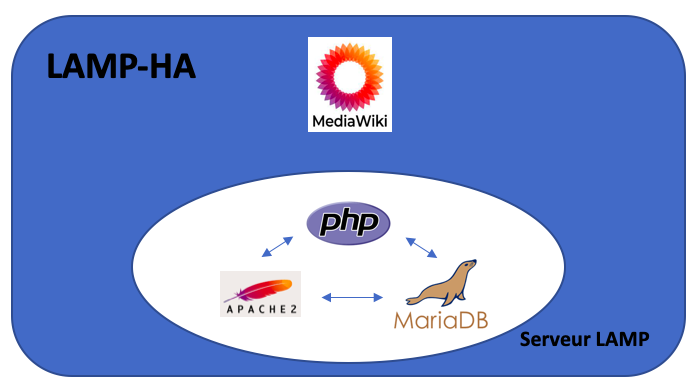

# DOCUMENTATION - Projet AJC 2021
Version: 1 - Date: 19-05-2021
## I. Introduction


_Figure 1: Objectif final du projet_
## II. deploy-az-it
#### II.A. Généralités
Ce playbook ansible a été développé pour permettre de déployer facilement l'ensemble de l'infrastrucure utilisée pour le projet.
#### II.B. Prérequis
Pour utiliser ce playbook, il est nécessaire d'installer au préalable sur la machine master:
- Ansible
- Azure CLI

Afin d'installer Ansible et Azure CLI, vous pouvez exécuter le script suivant dans un terminal (Debian 10):
```shell
# Ansible
sudo echo "deb http://ppa.launchpad.net/ansible/ansible/ubuntu trusty main" >> /etc/apt/sources.list
sudo apt-key adv --keyserver keyserver.ubuntu.com --recv-keys 93C4A3FD7BB9C367
sudo apt update
sudo apt install ansible

# Azure CLI
curl -sL https://aka.ms/InstallAzureCLIDeb | sudo bash
```
Dans le cadre du projet, les versions suivantes ont été utilisé:
- Ansible: 2.9.21
- Interpreteur Python: 2.7.16 (default, Oct 10 2019, 22:02:15) [GCC 8.3.0]
- Azure CLI: 2.23.0

#### II.C. Utilisation
```shell
ansible-playbook -i ../hosts infra.deploy.yml
```
## III. config-az-it
#### III.A Généralités
Les projet config-az-it est utilisé pour installer et configurer les outils de base sur l'ensemble des machines distantes.

Liste des outils installés:
- vim
- git
- htop
- zsh
- tmux
- apt-transport-https
- ca-certificates
- curl
- gnupg
- lsb-release

Liste des plugins installés:
- oh-my-zsh
- pathogen

Fichiers de configuration modifiés:
- bash (~/.bashrc)
- zsh (~/.zshrc)
- vim (~/.vimrc)
- SSH (/etc/ssh/sshd_config)

#### III.B. Prérequis
Les prérequis sont identiques à la partie **deploy-az-it** (II.B).
#### III.C Utilisation
```shell
ansible-playbook -i ../hosts infra.setup.yml
```
## IV. install-lamp-ha - MEDIAWIKI


_Figure 2: Architecture du projet MediaWiki_
#### IV.A. Généralités et architecture
MediaWiki est un logiciel de type wiki permettant de réaliser des articles en ligne ; c'est un réservoir de contenus dans lequel les pages Web sont modifiables par tous (collaboratif).

La machine virtuelle fournit les fonctionnalités suivantes:
- Site public de l'application
- Le service web et la base de données qui communique avec le logiciel client

#### IV.B. Technologies utilisées
La machine virtuelle est composée de trois parties distinctes :
	- un serveur web Apache2 (2.4.38)
	- une base de données MariaDB (15.1)
	- une application php : MediaWiki.

Ces composantes ont été déployées et configurés à l'aide de la plate-forme logicielle Ansible. 

Apache2 et mariaDB ont été choisis dans le cadre de ce projet car ce sont des api simples à déployer. Apache2 permet de développer des applications web rapidement, tandis que MariaDB a été choisie comme serveur de base de données car il est à la fois open-source et performant.
#### IV.C. Interactions extérieures
La machine Master communique avec la machine virtuelle LAMP-HA par SSH, tandis que le client va s'y connecter par un protocole HTTPS, afin de sécuriser l'accès à ce dernier
#### IV.D. Déploiement des différentes composantes
Afin de réaliser le déploiement, puis la configuration des différents modules composants la machine virtuelle, un playbook a été réalisé pour installer apache2, mariadb-server ainsi que différents packages php nécessaires pour l'utilisation et le déploiement de MediaWiki et MariaDB.
Ce playbook permet par la suite :
- une mise en marche du serveur web et sa configuration (dont une refonte du site par défaut d'Apache 2)
- une sécurisation des serveurs, puis de la connection via une génération de certificats autosignés
- une mise en place et la configuration de la base de données
- une installation de Mediawiki via le téléchargement du fichier .tar.gz d'installation et son désarchivement dans la machine virtuelle.

## XX. install-pyhttp - PyHTTP SERVER
#### XX.A. Généralités
Le projet install-pyhttp permet de déployer rapidement un serveur HTTP écrit en Python. Afin de faciliter la mise à jour de l'application, l'ensemble du serveur est déployé dans un conteneur Docker. Pour plus de sécurité, ce serveur utilise le protocole HTTPS. 
#### XX.B. Prérequis
Pour utiliser ce playbook, il est nécessaire d'installer au préalable sur la machine master:
- Ansible
- Azure CLI

De plus, afin qu'Ansible puisse communiquer avec la machine distante, il est nécessaire d'avoir configurer au préalable une connexion SSH par clés. Cependant, si vous avez utilisé le projet _config-az-it_, cette étape a normalement déjà été réalisée.

Afin d'installer Ansible et Azure CLI, vous pouvez exécuter le script présenté dans la partie **deploy-az-it** (II.B).
#### XX.C Configuration
Avant de lancer le playbook, il est impératif d'éditer le fichier _hosts_ présent à la racine du projet. Pour cela, veuillez indiquer l'adresse IP publique de votre machine distante dans la partie [azure-pyhttp].
Il est également recommandé de modifier le fichier _vars/vars.yml_ afin de personnaliser les paramètres du playbook.
#### XX.D. Utilisation
```shell
ansible-playbook -i ../hosts pyhttp.deploy.yml
```
## À noter
Les projets _deploy-az-vmss_, _install-gitlab_, _install-jenkins_, _install-mediawiki_ et _jekyll_ sont actuellement **obsolètes** ou en phase de test et remplacés par un des projets décrit ci-dessus.
